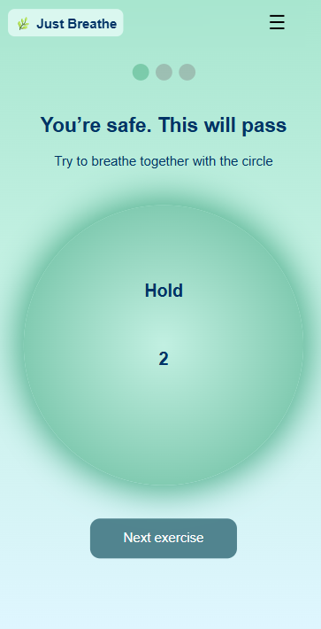

# 🌿 Just Breathe

**Just Breathe** is a small web app designed to help calm panic attacks using guided breathing and grounding exercises. It focuses on simplicity, clarity, and being usable in moments of stress.

🌐 **Live demo:** https://your-vercel-link-here

---

## Why this app exists

I build _Just Breathe_ as a practical tool for moments when anxiety or panic makes it hard to think clearly. The goal is to create something minimal and gentle: no overwhelming options, no noise, just a few techniques that are easy to follow when you need them most.

This project is also a way for me to explore how thoughtful UI, animation, and structure can support users in emotionally sensitive situations.

---

## Features

### Current features

- Guided breathing exercise with visual animation
- Grounding exercise to help refocus attention
- Clean, distraction-free UI
- Responsive design (mobile-first mindset)
- Deployed and continuously updated

### Planned / in progress

- UI/UX refinements and accessibility improvements
- Optional sound support for breathing and grounding exercises
- Offline functionality using browser storage / PWA features

---

## Screenshot



---

## Tech stack

- **Frontend:** React + TypeScript
- **Styling:** CSS Modules
- **Build tool:** Vite
- **CI/CD:** GitHub Actions + semantic-release
- **Deployment:** Vercel

---

## Local development

To run the project locally:

```bash
npm install
npm run dev
```

Build for production:

```bash
npm run build
```

---

## Project status

🚧 **Work in progress**

This project is actively developed. Features, UI, and structure may change as the app evolves.

---

## Disclaimer

This app is **not a medical device** and does not replace professional medical or psychological help.  
It is intended as a supportive, self-help tool only.

---

## Feedback

Feedback and suggestions are very welcome.  
Feel free to open an issue or reach out if you have ideas or notice problems.
